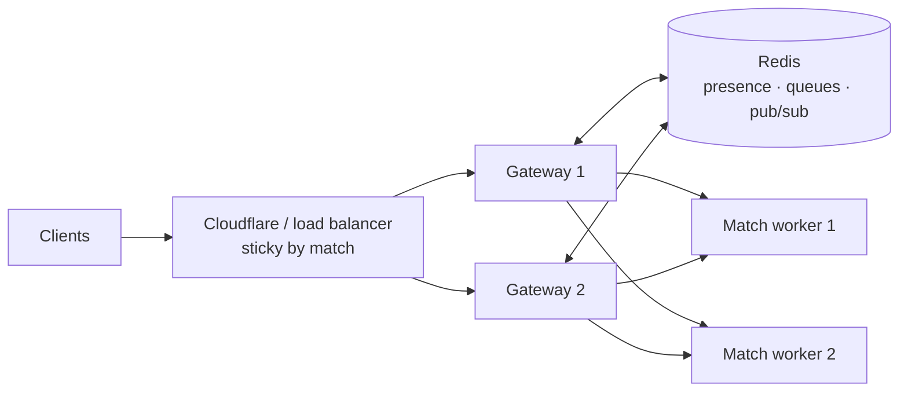

Resolves `OPS-*`, `NET-10`, `API-05` to `API-08`, `LEG-03`. Roadmap items
P0.5, P2.4, P2.6, P4.1. Review: [operations](/review/operations/).

## Environments

| Environment | Where | Data | Deploys |
|---|---|---|---|
| Development | Laptop, `docker compose` | Throwaway | Manual |
| Staging | Same host, separate Compose project, `staging.puyo.live` | Anonymised copy of production, weekly | Every merge to `main` |
| Production | Home server behind Cloudflare Tunnel | Real | Promoting a staging release (tag `vX.Y.Z`) |

## Delivery

- Images are tagged with the commit SHA and, on release, the version. Nothing
  deploys `:latest`.
- A deploy job (GitHub Actions over SSH, or a small agent on the host) runs
  `docker compose pull && docker compose up -d` for a specific tag, waits for
  health checks, and rolls back to the previous tag if they fail. This replaces
  Watchtower and removes its Docker-socket access.
- **Drain before swap**: the game server stops matchmaking, lets live matches
  finish (bounded at 5 minutes), then exits; the new version starts.
- **Migrations are expand then contract**: additive changes first (deployable
  with the old code still running), destructive changes only in a later
  release. The new moderation migration is an example: additive and
  idempotent.
- `/health` reports version, commit and uptime for every service.

## Observability

| Signal | Tool | Notes |
|---|---|---|
| Errors | GlitchTip (self-hosted, Sentry-compatible) | Client, game server, API; source maps uploaded by CI |
| Metrics | Prometheus + Grafana | `/metrics` on each service |
| Logs | pino (JSON) → Loki | Every line carries `requestId` or `matchId` |
| Traces | OpenTelemetry | Client → game server → API spans for match start and match end |
| Uptime | Uptime Kuma | External checks; drives the site's status indicator |

**Service level objectives**, the numbers the team watches:

| Objective | Target |
|---|---|
| Match start success | ≥ 99.5% of paired players reach frame 0 |
| Desync rate | < 1 per 1,000 matches (hash mismatch between client and server) |
| Input to display (p95, local board) | ≤ 1 frame of processing plus display latency |
| API latency (p95) | ≤ 150 ms |
| Availability | ≥ 99.5% monthly |

## Data

- **PostgreSQL**: continuous WAL archiving to object storage (WAL-G to R2) for
  point-in-time recovery, plus a nightly logical dump. A monthly CI job
  restores the latest backup into a scratch database and runs the API test
  suite against it (OPS-03).
- **Object storage (R2)**: avatars (re-encoded to 256 × 256 WebP) and replays
  (gzip JSON, typically 10–40 KB). Served through the CDN.
- **Retention**: login logs 90 days, audit logs 2 years, replays indefinitely
  (small), deleted accounts purged in 30 days.

## Security

- Sessions: short-lived access tokens and rotating refresh tokens in `httpOnly`
  cookies, a `sessions` table, sign out everywhere.
- Validation: shared Zod schemas (`packages/protocol`) on every REST body and
  socket event.
- Headers: a strict Content Security Policy for the client (self, the API, the
  game server), HSTS, `frame-ancestors 'none'`.
- Supply chain: Dependabot (added), CodeQL, secret scanning, Actions pinned by
  SHA, an SBOM per image, image signing with cosign.
- Abuse: login throttling keyed by account and address, stored in Redis once
  there is more than one instance.

## Scale (deferred to phase 4)

One Node process comfortably serves thousands of concurrent matches: the
simulation is a few microseconds per frame per player. Scale out only when
metrics say so:

Gateways hold sockets and presence; match workers own matches; Redis carries
the matchmaking queue and Socket.IO's adapter. The engine's determinism means a
match can even be migrated between workers by moving its input log.
