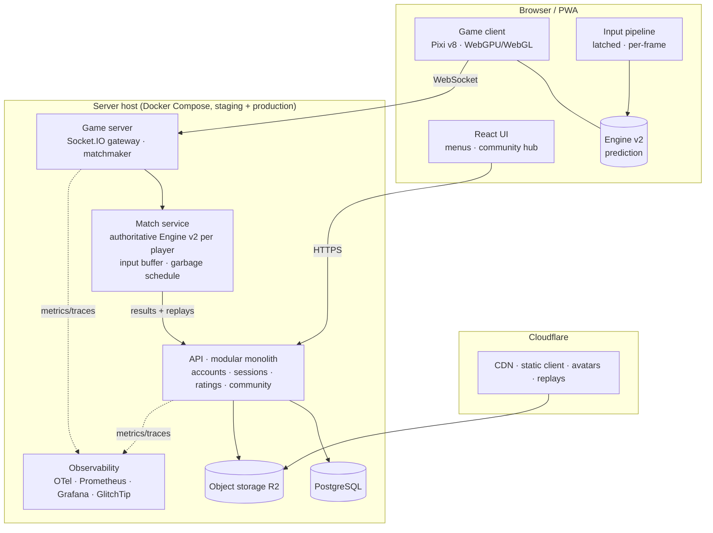

This is where the system is going. The [roadmap](/roadmap/) sequences it; each
area has its own page. The design keeps what already works (a deterministic,
shared engine and event-sourced replays) and builds the missing layers on it,
rather than rewriting.

## Principles

1. **One simulation, run everywhere, trusted only on the server.** Clients
   predict; the server decides.
2. **Rules are data.** A versioned ruleset travels with every match and replay.
3. **Every contract has one declaration.** Engine types, replay format, wire
   protocol and REST schemas each live in one package that all consumers import.
4. **Measure what players feel.** Latency, desyncs, frame rate and load time
   have budgets and are measured in CI and in production.
5. **Boring infrastructure.** A modular monolith on one host until the numbers
   say otherwise. Every added moving part must pay for itself.

## Containers

## Shared packages

| Package | Holds | Replaces |
|---|---|---|
| `packages/engine` | Engine v2: rules as data, snapshot/restore, full-state hash, independent RNG streams, typed events | Today's engine (extended, not rewritten) |
| `packages/protocol` | Zod schemas and TypeScript types for every Socket.IO event and REST body; typed Socket.IO client and server | Hand-written validation in `server/index.ts` and route handlers |
| `packages/rating` | Glicko-2, pure and tested | Elo inside `match.service.ts` |

## The key decisions, and why

### Server authority with rollback prediction

Detailed in [netcode](/architecture/netcode/). The server simulates both
players from their frame-stamped inputs, a small fixed delay behind real time,
and is the only source of garbage and top-out. Clients never wait for it: each
client predicts its own board with zero input delay, and corrects in the rare
case the server disagrees. Puyo is unusually friendly to this. The only
interaction between the two boards is garbage, and garbage lands after a delay
of hundreds of milliseconds, which hides almost every correction.

*Why not keep client authority and add checks?* Checks on a trusted client are
an arms race; an authoritative simulation from inputs removes the whole class
of cheat. The engine is already deterministic and shared, so the cost is mostly
already paid.

### Rulesets as data

Detailed in [engine v2](/architecture/engine-v2/). A ruleset (scoring tables,
timings, caps, colours, field rules) is a value recorded in every replay.
Ranked can use Tsu rules while casual keeps today's, fixing a rule never
orphans an old replay, and room settings become rules instead of dead fields.

### Glicko-2 ratings

Detailed in [rating and matchmaking](/architecture/rating-and-matchmaking/).
Ratings carry an uncertainty, so new players settle quickly, veterans stay
stable, and matchmaking can pair by skill with confidence.

### A community hub in the API

Detailed in [community hub](/architecture/community/). Forums, news, player
pages, rankings and a replay gallery are a module of the existing API, not a
new service. They share accounts, sessions and moderation, and they are where
retention comes from.

### An operational floor before scale

Detailed in [platform](/architecture/platform/). Staging, pinned releases,
rollback, drained deploys, error tracking, metrics and tested backups come
before any horizontal scaling. The path to horizontal scale (gateway plus room
servers with Redis) is designed but deliberately deferred to phase 4.

## What stays

- The deterministic, fixed-step, compiler-enforced-pure engine.
- Seed-plus-input replays and state-hash verification.
- The shared match clock and input-simulated opponent view.
- PostgreSQL, Prisma, Express, Socket.IO, PixiJS and React: all current and
  capable. Upgrading majors is maintenance, not re-architecture.
- Docker Compose on a home server behind a Cloudflare Tunnel, which is cheap
  and adequate until player numbers say otherwise.
