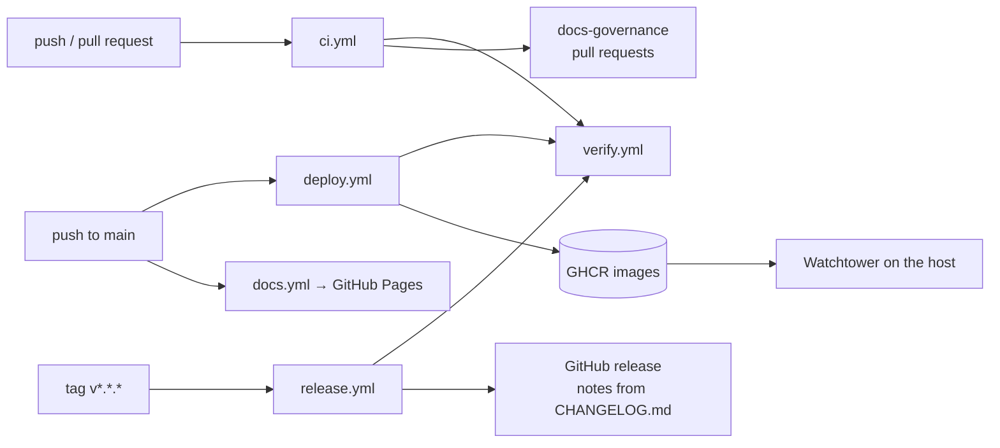

Everything is in `.github/workflows/`. One reusable pipeline, `verify.yml`,
is the gate for everything else: nothing is published without it.

## `verify.yml`: the gate

| Job | Fails when |
|---|---|
| Type check | The engine (under its own no-DOM, no-Node tsconfig), the client with its tests, the API, the game server or the tooling scripts do not compile |
| Engine tests | `npm test` fails, or a characterization golden changed during the run |
| API tests | Migrations do not apply to an empty PostgreSQL 18 (the version production runs), `schema.prisma` has changes no migration applies (`prisma migrate diff`), or the API suite fails |
| Docs site | The documentation site does not build, including any broken internal link |
| Build artifacts | The client does not build, or builds to nothing |
| Deploy smoke test | The Docker stack (database, API, game server) does not boot, the API is not healthy and connected to the database, the game server does not answer, or the migrations did not create the tables |

## `ci.yml`: every push and pull request

Runs `verify.yml` on every branch. On pull requests to `main` it also runs
**Docs governance**, `scripts/docs-check.ts` against the base branch, with the
pull request description available for waivers. Dependabot's pull requests
skip that one job. The rules are on
[Documentation system](/start/documentation-system/).

Superseded runs on the same branch are cancelled.

## `deploy.yml`: production

On every push to `main`, after `verify.yml` passes, it builds the API and game
server images and pushes them to GHCR as `latest` and as the commit SHA:

- `ghcr.io/loganocm/puyio-api` from `api/Dockerfile`;
- `ghcr.io/loganocm/puyio-game` from `server/Dockerfile`, with the repository
  root as context because the server needs `packages/engine`.

On the host, Watchtower polls GHCR every five minutes and replaces running
containers with the new `latest`, so **a merge to main is in production within
about five minutes** and `verify.yml` is the only gate (OPS-01). The client is
built and hosted separately by Vercel (`vercel.json`).

## `release.yml`: releases

Pushing a tag `vX.Y.Z` runs `verify.yml`, then `scripts/release-notes.ts`,
which fails unless `package.json` is at that version and `CHANGELOG.md` has a
`## [X.Y.Z]` section, then creates a GitHub release whose notes are exactly that
section. Release notes are never written anywhere else. Steps:
[Release](/guides/release/).

## `docs.yml`: the documentation site

On pushes to `main` that touch `website/`, `docs/` or `CHANGELOG.md`, it builds
the site and publishes it to GitHub Pages. It is off until the repository
variable `DOCS_DEPLOY_ENABLED` is `true` (and Pages is set to deploy from
Actions), so a repository without Pages keeps a green `main`. `DOCS_SITE_URL`
sets the public address.

## Dependabot

`.github/dependabot.yml` opens weekly, grouped minor-and-patch updates for the
root workspace, the API, the documentation site and the Actions themselves.

## The host

`docker-compose.yml` is the production stack:

| Service | Does |
|---|---|
| `db` | PostgreSQL 18, data in `./data/postgres` |
| `api` | The REST API on 8080; its entrypoint runs `prisma migrate deploy` before starting |
| `game-server` | The game server on 3000, `NODE_ENV=production` |
| `tunnel` | Cloudflare Tunnel: the only way in; no inbound ports are opened on the host |
| `watchtower` | Pulls new images from GHCR every 300 s |
| `db-backup` | `pg_dump -Fc \| gzip` at start and every 10 days, keeping the last 10 in the `puyio_backups` volume on the same host; restores have never been tested (OPS-03) |

Every service's logs are capped at 10 MB × 3 files, added after container logs
filled the disk.

On Windows the stack runs under Docker Desktop with the WSL2 backend, which
produces the same `linux/amd64` containers CI builds. Keep the repository
inside the WSL2 filesystem: PostgreSQL on a Windows-path bind mount fails with
permission errors on its data directory.
