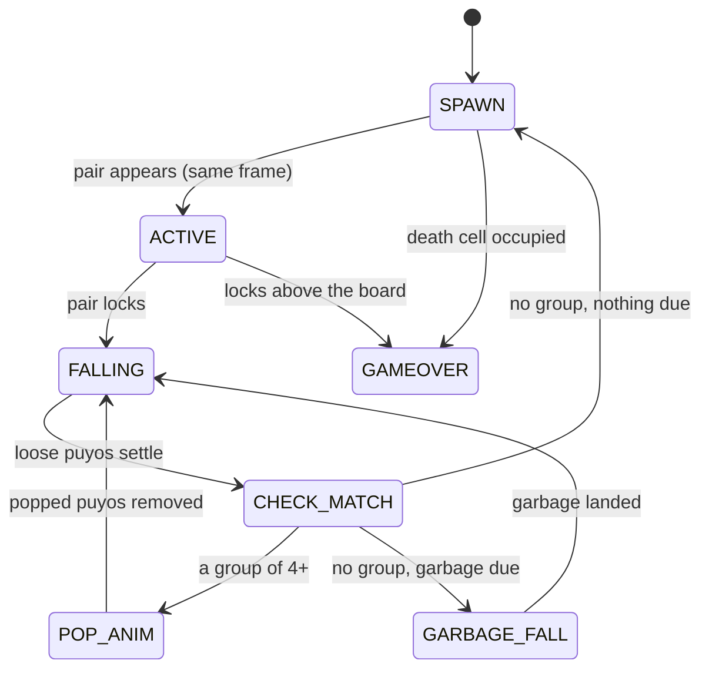

The simulation counts **logical frames**: 60 per second, one call to
`GameEngine.update()` each. Nothing in `packages/engine` reads a clock, so the
same seed and inputs give the same game on any machine at any refresh rate.
Timings below are in frames, with wall time in brackets.

## Who advances the engine

Exactly one place steps the engine, once per logical frame, and input for that
frame is applied **after** the step (ADR 0001, ADR 0005). Calling `update()`
anywhere else runs the game at the wrong speed and breaks replays; it happened
once, and every timing was tuned at double speed as a result.

| Mode | What decides how many frames to step | Where |
|---|---|---|
| Single player | Real time, accumulated in logical frames; at most 5 steps per rendered frame, and any backlog beyond 5 is dropped rather than fast-forwarded | `GameScene` (`MAX_CATCHUP_STEPS`), `QuickPlayScene` |
| Multiplayer | The shared match clock: `targetFrame = floor((serverNow − startAt) / (1000/60))`; at most 5 frames of catch-up per rendered frame; never runs ahead | `src/core/MatchClock.ts` (ADR 0003) |
| Opponent view | The match clock minus a jitter buffer of 6–24 frames (100–400 ms), sized from measured round trip | `src/core/OpponentView.ts` (ADR 0004) |
| Replay viewer | The playback speed chosen by the viewer | `src/scenes/ReplayScene.ts` |
| Animation lab | The scenario driver, one frame per step | `src/lab/LabDriver.ts` |
| Game server | A 16 ms `setInterval`, one step per tick, not tied to the match clock (NET-04); inputs are applied as they arrive | `server/index.ts`, `server/PuyoSimulator.ts` |

A multiplayer client more than 180 frames (3 s) behind the shared clock shows
"RECONNECTING…" (CLI-20). The frame order within one step is:

1. `engine.update()` — the state machine advances one frame.
2. The board hash is recorded, if this is a checkpoint frame
   (`GameScene.applyInput`).
3. `HandlingController.frame()` applies this frame's input; every change is
   recorded with this frame's number.

That order is part of the replay format: see
[the ordering invariant](/reference/replay-format/#the-ordering-invariant).

## The state machine

`GameState` values: `SPAWN` 0, `ACTIVE` 1, `FALLING` 2, `CHECK_MATCH` 3,
`POP_ANIM` 4, `GARBAGE_FALL` 5, `GAMEOVER` 6. Every transition resets
`stateTimer` to 0.

## Moving piece

| Timer | Frames | Rule |
|---|---|---|
| Spawn delay | 0 | The next pair appears on the same frame the previous turn ends |
| Gravity | 30 (0.5 s) per row | `currentDropDelay` |
| Soft drop | `max(1, floor(30 / SDF))` per row | SDF 20 → 1 frame per row; SDF 40 or more drops to the stack at once, without locking |
| Lock delay | locks on the 16th frame touching down (0.27 s) | `lockTimer > lockDelay` (15). Every successful move or rotation resets it, without limit (RUL-05) |
| Glide | timer paused | While a horizontal key is held (`HH`), the lock timer does not count |
| Soft drop on the stack | 0 | Holding soft drop while touching down locks at once |
| Soft drop protection | timer paused | A soft drop held through the spawn does not speed up the new pair, and its lock timer does not count, until the key is released |
| Hard drop | 0 | Drops and locks in the same frame |

## Resolving a turn

After a pair locks, the turn resolves at a pace set by the chain count.
Each step's duration is `chainScaledDuration(base, n)`
(`packages/engine/src/GameEngine.ts`):

- links 0 and 1: `base × 2`;
- link *n* ≥ 2: `floor(base × (1 + 0.3 × 1.3^(n−1)))`.

The pop uses base 9 (`POP_ANIM_FRAMES`) and lasts exactly that many frames;
the settle uses base 5 (`FALL_STEP_FRAMES`) and lasts one frame more
(`stateTimer > scaled`). Everything that falls moves to its destination in one
step at the end of the settle; the slide you see is drawn by the renderer.

| Moment | Frames |
|---|---|
| Lock → next pair, nothing falls | 2 (lock, settle check, spawn) |
| Lock → next pair, a split pair falls | 12 |
| One link: check + pop + settle | see below |

| Link | Pop | Settle | Link total | Wall time | Chain so far |
|---|---|---|---|---|---|
| 1 | 18 | 11 | 30 | 0.50 s | 0.5 s |
| 2 | 12 | 7 | 20 | 0.33 s | |
| 3 | 13 | 8 | 22 | 0.37 s | |
| 5 | 16 | 10 | 27 | 0.45 s | 2.0 s |
| 10 | 37 | 21 | 59 | 0.98 s | 5.7 s |
| 15 | 115 | 65 | 181 | 3.0 s | 15.6 s |
| 19 | 312 | 174 | 487 | 8.1 s | 38.8 s |

The first link is slower than the second, and links past 10 grow
exponentially: a 19-chain takes almost 40 seconds to resolve. Tsu pops in a
constant 50 frames. This is finding RUL-03, a ruleset decision for
[engine v2](/architecture/engine-v2/).

### Garbage

Garbage that is due falls after the chain (if any) ends and before the next
pair spawns, at most 24 puyos per turn. Each puyo starts two or more rows
above the board and falls **1.5 rows per frame**, so a drop to the floor takes
about 10 frames (0.17 s); then the board settles and checks for groups as
usual. Unlike the rest of the turn, the falling garbage's position is engine
state (`fallingGarbage`), because the landing frame depends on it.

## Handling

DAS and ARR are player settings counted in logical frames by
`HandlingController` (`src/input/Handling.ts`), once per engine step, so they
feel the same on 60 Hz and 240 Hz displays (CLI-01).

| Setting | Meaning |
|---|---|
| DAS | Frames a direction is held before it starts repeating. The first move happens on the press |
| ARR | Frames between repeats once DAS has charged; 0 moves straight to the wall |
| SDF | Soft drop factor (above) |

| Preset | DAS | ARR | SDF |
|---|---|---|---|
| Relaxed | 16 (267 ms) | 4 (67 ms) | 10 |
| Standard (default) | 10 (167 ms) | 2 (33 ms) | 20 |
| Competitive | 7 (117 ms) | 0 | 40 |

- The most recent direction pressed wins; releasing it hands over to the other
  direction if it is still held, as a fresh press.
- A new pair moves on its first frame if DAS is already charged, and the repeat
  cadence restarts from there.
- A press and release between two logical frames still counts: `Input` latches
  presses until the next step (CLI-11).
- The feel targets behind these numbers are in [Game feel](/design/game-feel/).

## Network clocks

| Timer | Value | Where |
|---|---|---|
| Match countdown | 3 000 ms from `startAt` announcement to frame 0 | `server/index.ts` (`MATCH_COUNTDOWN_MS`) |
| Board snapshot on change | at most every 500 ms | `GameScene` (`BOARD_SYNC_INTERVAL_MS`) |
| Liveness heartbeat | a board snapshot at least every 2 000 ms while the game loop runs | `GameScene` (`HEARTBEAT_INTERVAL_MS`) |
| Server liveness check | every 3 s; a player silent for 7 s is aborted, but not in the first 7 s of a match | `server/index.ts`, `GameRoom.findStalledPlayer` |
| Board hash checkpoint | every 300 frames (5 s) | `GameScene`, see [Replay format](/reference/replay-format/) |

Inputs (`record_input`) also count as signs of life (NET-13).

## Time limits

Timed modes count **wall-clock seconds** in the scene, not engine frames. If
the engine falls behind (the catch-up limit above), the timer keeps counting.
The time-up ending goes through `changeState(GAMEOVER)` like every other ending
(ENG-07).
