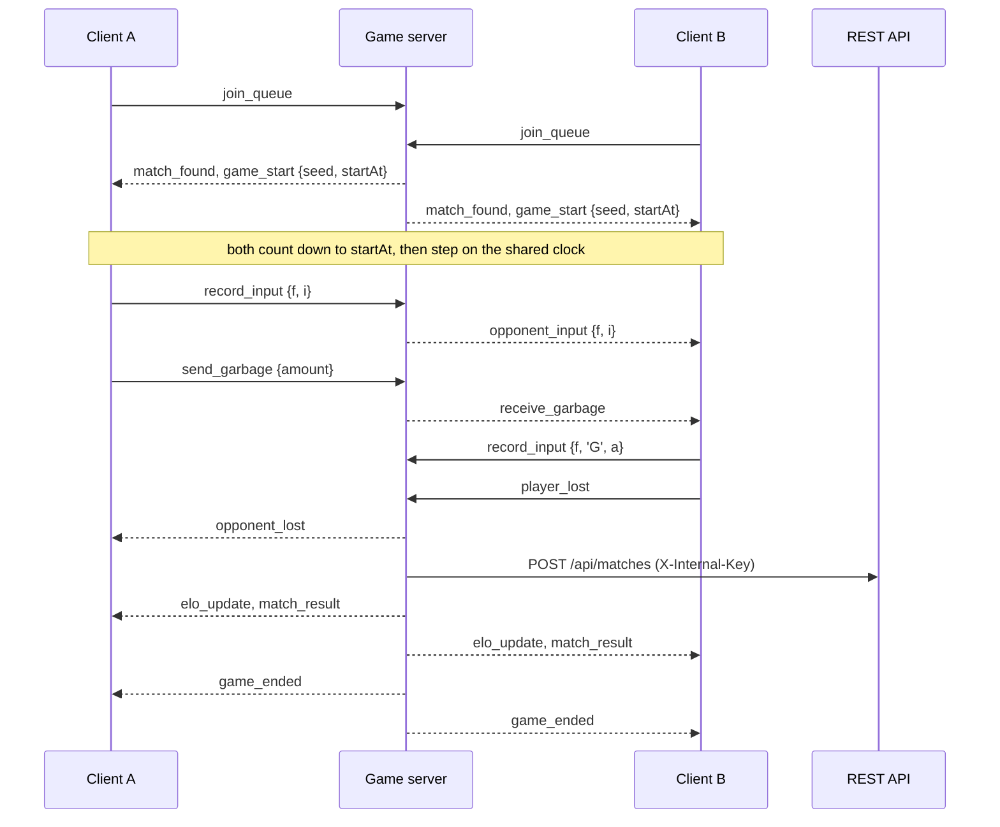

The client and the game server talk over Socket.IO (`server/index.ts`,
`src/core/NetworkManager.ts`). This page lists every event as the code has it.
The target design, with server-side verification and rollback, is
[Netcode](/architecture/netcode/).

## Connection

| | |
|---|---|
| URL | `VITE_SOCKET_URL` (or `VITE_SERVER_URL`); otherwise `http://localhost:3000` on localhost and `https://game.puyo.live` elsewhere |
| Transports | WebSocket, falling back to long polling |
| Reconnection | 10 attempts, 1 s apart |
| Server limits | 256 KB per message (`maxHttpBufferSize`); ping every 25 s, timeout 60 s |
| Origins | A fixed list in `server/index.ts`, plus `EXTRA_CORS_ORIGINS` outside production ([Configuration](/reference/configuration/)) |
| Identity | `socketId` per connection; `userId` after `authenticate`; `playerIndex` 0 or 1 within a room. A reconnect changes the socket but keeps the other two |

On connect the server sends `welcome { message, id }` and `queue_update`.

## Validation and limits

Every handler checks its payload's types and ranges and silently drops
anything else. Most events also have a per-socket, per-event limit over a
sliding one-second window (`checkSocketRate`); events over the limit are
dropped without a reply.

## Client → server

### Session and matchmaking

| Event | Payload | Limit /s | Effect |
|---|---|---|---|
| `time_sync` | `{ t }` client timestamp | 12 | Replies `time_sync_reply { t, server }` at once, never delayed, so the client can estimate its clock offset ([MatchClock](/reference/frame-timing/#who-advances-the-engine)) |
| `authenticate` | `{ token }` (≤ 2 048 chars) | 3 | Verifies the JWT with the API; replies `authenticated { success, user? , error? }` |
| `get_queue_stats` | — | 5 | Replies `queue_update` |
| `join_queue` | `{ ranked? }` | 2 | Ranked requires authentication. Two waiting players are paired in arrival order (NET-09) |
| `leave_queue` | — | — | |
| `requeue` | `{ roomId }` | 2 | Leave the finished room (the other player gets `opponent_left`) and queue again in the same mode; replies `requeue_confirmed` |

### Custom rooms

| Event | Payload | Limit /s | Effect |
|---|---|---|---|
| `get_rooms` | — | 5 | Replies `room_list_update` to the sender only (it used to broadcast to everyone, NET-17) |
| `create_room` | `{ isPrivate? }` | 1 | Replies `room_created { roomId }` |
| `join_room` | `roomId` | 3 | Joins, or rejoins a match in progress (`reconnected`) |
| `toggle_ready` | `{ roomId, ready }` | 5 | Broadcasts `room_update` |
| `get_room_details` | `{ roomId }` | 5 | Replies `room_update` |
| `update_room_settings` | `{ roomId, settings }` | 5 | Host only; broadcasts `room_settings_update`. `marginTime`, `garbageMultiplier` and `bestOf` are stored but have no effect (RUL-10) |
| `start_game` | `roomId` | 2 | Host only; starts the match (below) |
| `leave_room` | `{ roomId }` | — | The opponent gets `opponent_left` |

### During a match

| Event | Payload | Limit /s | Effect |
|---|---|---|---|
| `record_settings` | `{ roomId, sdf, softDropProtection }` | 3 | Stores the player's handling for the replay; SDF clamped to 1–40 |
| `record_input` | `{ roomId, input, f, a? }` | 120 | One [input symbol](/reference/replay-format/#inputs) at frame `f` (0–360 000). Recorded in the replay, relayed to the opponent as `opponent_input`, applied to the server's simulation, and counted as a sign of life |
| `record_hash` | `{ roomId, f, hash }` | 10 | A board hash checkpoint for the replay |
| `send_garbage` | `{ roomId, amount, chainLength? }` | 30 | `amount` 1–100. Relayed to the opponent as `receive_garbage { amount }`; counted in match stats. **Trusted as sent** (NET-01) |
| `send_board_state` | `{ roomId, grid, garbageTray? }` | 10 | A 6 × 14 grid of integers 0–15. Relayed as `receive_board_state { grid, playerId }` and counted as a sign of life. The client sends it at most every 500 ms on change and at least every 2 s |
| `player_lost` | `{ roomId }` | — | The sender topped out. **Trusted as sent** (NET-02) |

### Puyo Mines

| Event | Payload | Limit /s | Effect |
|---|---|---|---|
| `join_mines` / `leave_mines` | — | 2 | Enter or leave the shared room; replies `mines_joined`, broadcasts `mines_player_list` |
| `mines_respawn` | — | 2 | Replies `mines_respawned` |
| `mines_set_target` | `{ mode }`: `random`, `attackers`, `badges`, `vulnerable` | 5 | Replies `mines_target_updated` |
| `mines_record_input` | `{ input }`: `L R CW CC SD SU HD` | — | Applied to the player's server simulation |
| `mines_send_garbage` | `{ amount }` 1–100 | 30 | Sent to the player's current target as `mines_receive_garbage` |
| `mines_player_lost` | — | — | Credits a KO to whoever targeted the player (`mines_ko`), broadcasts `mines_player_died_broadcast` |
| `mines_tick_frame`, `mines_board_state`, `mines_score_update` | — | — | Accepted and ignored |

### Administration

| Event | Payload | Limit /s | Effect |
|---|---|---|---|
| `admin_list_rooms` | — | 3 | Admins only; replies `admin_rooms_list` |
| `admin_delete_room` | `{ roomId }` | 3 | Admins only; players get `game_ended { reason: 'admin_closed' }`, the admin `admin_room_deleted` |

## Server → client

| Event | Payload | When |
|---|---|---|
| `match_found` | `{ roomId, ranked, players: [{ username, elo, userId?, gamesPlayed, garbageSent, avatarUrl?, rank? }] × 2 }` | Matchmaking paired two players (the versus screen) |
| `player_joined` | `{ id, count }` | Someone entered the room |
| `game_start` | `{ seed, roomId, players: socketId[], startAt }` | A match begins: frame 0 is at `startAt` on the server clock, 3 s ahead |
| `opponent_input` | `{ playerId, f, i, a? }` | Each of the opponent's inputs, for the [opponent view](/architecture/netcode/) |
| `receive_garbage` | `{ amount }` | The opponent sent garbage |
| `receive_board_state` | `{ grid, playerId }` | The opponent's board snapshot, used to reconcile the opponent view |
| `opponent_lost` / `opponent_left` | — (`opponent_left` may carry `{ id }`) | The other player topped out / disconnected or left: you win |
| `elo_update` | `{ new_elo, change }` | Ranked result recorded |
| `match_result` | `{ matchId, result, xp_gained, new_level, new_xp, elo_change, new_elo }` | Ranked result recorded, per player (NET-14) |
| `game_ended` | `{ roomId, reason, message? }`; reason `lost`, `disconnect`, `aborted`, `admin_closed` | Always sent last; the room is deleted shortly after |
| `leaderboard_update` | — | To everyone after a ranked result |
| `reconnected` | `{ roomId, message }` | A rejoin into a running match succeeded |
| `room_update`, `room_settings_update`, `room_list_update`, `room_closed` | room state | Custom room changes; `room_closed` after inactivity |
| `queue_update` | `{ count, ranked, unranked }` | On connect and whenever a queue changes |
| `mines_state_sync`, `mines_target_board`, `mines_player_*`, `mines_ko`, `mines_state`, `mines_receive_garbage` | Mines state | Puyo Mines (`mines_target_board` added in 0.3.0, NET-15) |
| `error` | `{ message }` | A refused request |

## Match lifecycle



Only **ranked** matches between two signed-in players are recorded; the server
sends the result and the replay to the API in one call
([API](/reference/api/#server-to-server)).

## Who decides what

| Decision | Decided by | Notes |
|---|---|---|
| Piece sequence | Seed from the server | The seed is a timestamp and is sent to both clients (NET-08) |
| Frame timing | Shared clock from the server | ADR 0003 |
| Garbage sent | **Client** | The server runs a simulation of each player but does not enforce it (NET-01, NET-04, NET-05) |
| Top-out | **Client** (`player_lost`) | NET-02 |
| Aborting a silent player | Server | 7 s without input or board (NET-03, NET-13) |
| Rating, XP, stored result | Server and API | Never the client |

The server's simulation runs on its own 16 ms timer and applies inputs when
they arrive, so it is a network round trip behind the clients; enforcing it
produced false losses, so enforcement was switched off. The fix is a
frame-aligned authoritative simulation with rollback, planned in
[Netcode](/architecture/netcode/).

## Testing with latency

Two tabs on one machine have almost no latency. Outside production the server
can delay every outbound gameplay event (not `time_sync_reply`):

```bash
SIMULATED_LATENCY_MS=80 npm run server
```
