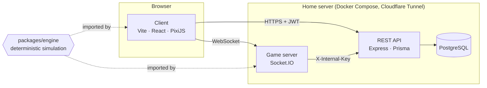

## The system in one picture

Three independently deployable Node processes plus a database, around one
shared simulation package. The browser talks REST to the API and WebSocket to
the game server; the game server calls the API server-to-server with a shared
secret.



| Part | Directory | Responsibility |
|---|---|---|
| Engine | `packages/engine/` | The rules: board, gravity, matching, scoring, garbage, piece generation, replay types. Pure and deterministic |
| Client | `src/` | Rendering, input, audio, all UI, the local and opponent simulations |
| Game server | `server/` | Matchmaking, rooms, input relay, replay assembly, Puyo Mines |
| REST API | `api/` | Accounts, JWT, match recording, Elo, XP, leaderboard, admin |
| Database | `api/prisma/` | Users, matches and replays, bans, audit and login logs |
| Docs site | `website/` | This site |

Match state is hot, ephemeral and lives in memory on the game server. Account
state is durable and lives in PostgreSQL. Nothing about a live match touches
the database until it ends; then one transaction records the result, both
rating snapshots, both XP changes and the serialised replay.

The [current architecture](/architecture/current/) page explains the timing,
authority and replay design in depth. The [target
architecture](/architecture/target/) page explains where it is going.

## Repository layout

```
packages/engine/     THE SIMULATION, shared by client and game server
  src/Constants.ts     the rules' dimensions: board size, colours
  src/Board.ts         grid, gravity, flood fill
  src/GameEngine.ts    state machine, scoring, garbage, piece generation
  src/replay.ts        replay format and ENGINE_VERSION, declared once
  src/env.d.ts         the engine's entire dependency on its host
src/
  core/              clock, opponent view, replay, network, input, audio, settings
  input/             HandlingController: DAS, ARR, rotation and drops per logical frame
  render/            BoardView (the only board renderer), backdrop, next queue, stat panel, layout
  theme/             colour, type and theme tokens
  scenes/            Pixi scenes: game, menu, quick play, replay
  screens/           React overlays and menus
  components/        shared React components (touch controls, music player, footer)
  community/         community hub routes and the safe Markdown renderer
  lab/               the animation lab: inventory, scenarios, driver
server/
  index.ts           socket handlers, matchmaking, rooms
  GameRoom.ts        per-room state, replay assembly
  PuyoSimulator.ts   adapter: wire alphabet in, recorded events out
  MinesRoom.ts       persistent free-for-all mode
api/
  src/routes/        REST endpoints
  src/services/      auth, match, leaderboard, XP, forums, avatars
  prisma/            schema and migrations
tests/
  engine/            characterization, replay fidelity, clock, opponent view, parity
  input/             handling
  lab/               the catalogue test and the browser recorders
  server/            game server units
  core/, community/  client units
  scripts/           the docs governance check and changelog extraction
  helpers/           deterministic drivers and fixed seeds
docs/
  adr/               architecture decision records (canonical)
  doc-map.json       which docs pages must change when which code changes
website/             this documentation site
scripts/             repository tooling: docs-check, release notes, icon rendering
```

## Where things live

| Concern | File |
|---|---|
| Simulation, state machine, scoring, garbage | `packages/engine/src/GameEngine.ts` |
| Grid, gravity, flood fill | `packages/engine/src/Board.ts` |
| Replay format declarations, `ENGINE_VERSION` | `packages/engine/src/replay.ts` |
| Shared frame timeline | `src/core/MatchClock.ts` |
| Opponent simulation | `src/core/OpponentView.ts` |
| Replay playback | `src/core/ReplayEngine.ts`, `src/core/ReplaySimulator.ts` |
| Game loop: stepping, input, network | `src/scenes/GameScene.ts` |
| Drawing a board | `src/render/BoardView.ts` |
| Key latching, DAS and ARR | `src/core/Input.ts`, `src/input/Handling.ts` |
| Colours, fonts, themes | `src/theme/tokens.ts` |
| Animations and their scenarios | `src/lab/animations.ts`, `src/lab/scenarios.ts` |
| Forums | `api/src/services/forum.service.ts`, `src/community/` |
| Wire alphabet to engine calls | `server/PuyoSimulator.ts` |
| Matchmaking, rooms, wire validation | `server/index.ts` |
| Accounts, rating, leaderboard | `api/src/services/` |
| Test drivers and fixed seeds | `tests/helpers/scriptedRun.ts` |

## How the engine is resolved

The client, Vitest and the client's `tsconfig.json` alias `@puyolive/engine` to
the package's **source** (`packages/engine/src/index.ts`). The game server
resolves the same package through `node_modules` to its **built output**, so
`npm run build:engine` must run before the server type-checks or builds. This
asymmetry is deliberate and explained in
[ADR 0006](/decisions/0006-shared-engine-package/).

The engine compiles with **no DOM library and no Node types**, so reaching for
`document`, `localStorage`, `Audio` or `process` inside it is a compile error.
Its one host dependency, `console.warn`, is declared in `src/env.d.ts`.

The names used throughout the code and these pages are defined once in the
[Glossary](/reference/glossary/).
